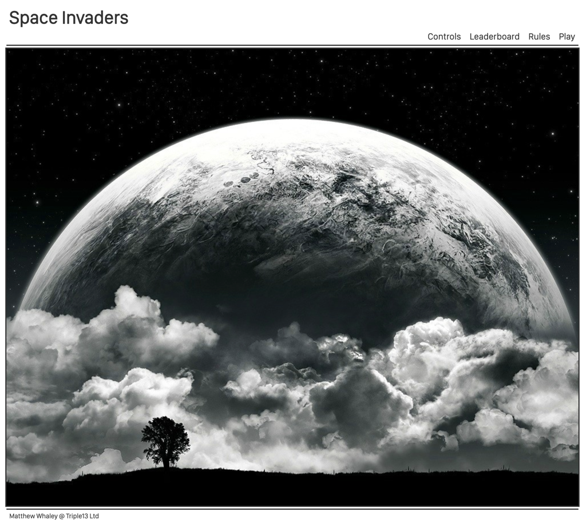
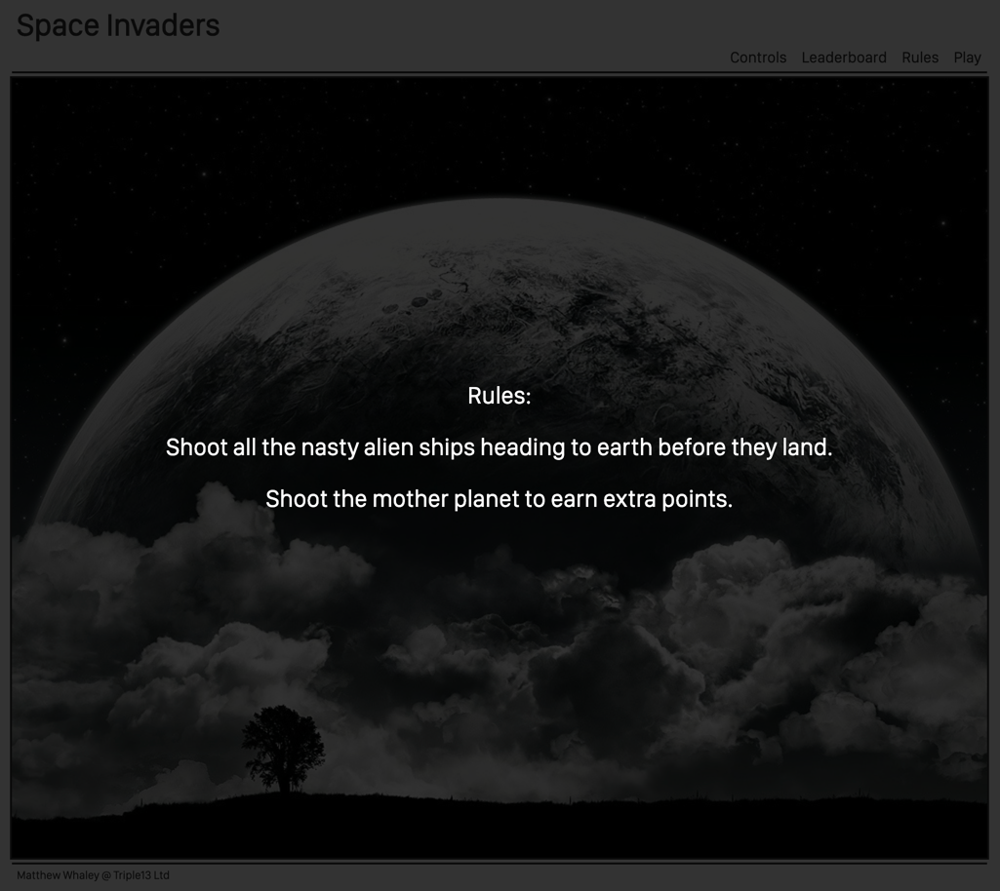
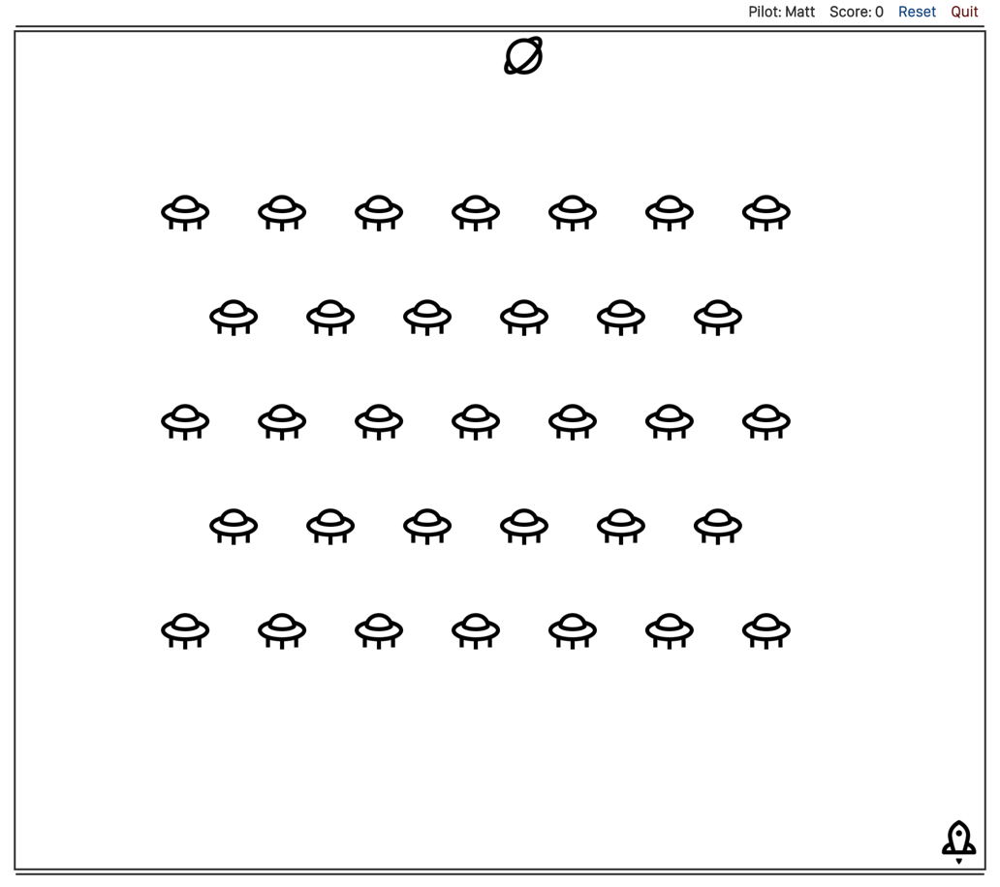

# Space Invaders - Project 1

<!-- toc -->

  * [Brief](#Brief)
    + [Space Invaders](#Space-Invaders)
    + [Resources](#Resources)
    + [Requirements](#Requirements)
    + [Suggested enhancements](#Suggested-enhancements)
    + [Challenges](#Challenges)
    + [Tips](#Tips)
- [Key concept](#Key-concept)
  * [Deliverables](#Deliverables)
  * [Technologies](#Technologies)
  * [Additional libraries](#Additional-libraries)
  * [Pages](#Pages)
  * [Obstacles](#Obstacles)
  * [Key components](#Key-components)
  * [Game Play Grid](#Game-Play-Grid)
  * [Tech theory behind the game play.](#Tech-theory-behind-the-game-play)
  * [Tech Ideas](#Tech-Ideas)
- [Result](#Result)
  * [Homepage](#Homepage)
  * [Rules](#Rules)
  * [Gameplay](#Gameplay)
  * [Wins](#Wins)
  * [Learnings](#Learnings)
  * [Loses](#Loses)
  * [Technicals](#Technicals)
    + [Functions](#Functions)
  * [Constructor](#Constructor)
    + [CSS](#CSS)

<!-- tocstop -->
---
### Brief 

>#### Space Invaders
> **Difficulty level: 2**
>Space Invaders is a classic arcade game from the 80s. The player aims to shoot an invading alien armada, before it reaches the planet's surface using a mounted gun turret.
>
>The player can only move left or right. The aliens also move from left to right, and also down each time the reach the side of the screen. The aliens also periodically drop bombs towards the player.
>
>Once the player has destroyed a wave of aliens, the game starts again. The aim is to achieve the highest score possible before either being destroyed by the aliens, or allowing them to >reach the planet's surface.
>
>#### Resources
>
>* [Space Invaders 1978 - Arcade Gameplay - Youtube](https://www.youtube.com/watch?v=MU4psw3ccUI)
>* [Space Invaders - Wikipedia](https://en.wikipedia.org/wiki/Space_Invaders)
>
>#### Requirements
>
>* The player should be able to clear at least one wave of aliens
>* The player's score should be displayed at the end of the game
>
>#### Suggested enhancements
>
>* Responsive design
>* Each wave gets more difficult
>* Persistent leaderboard using `localStorage`
>
>#### Challenges
>
>The main challenge here is the movement of large groups of aliens in formation, and the animation of the bombs and player's shots. There are several approaches here, with collision >detection being the more challenging.
>
>#### Tips
>
>* Make sure you spend plenty of time planning _before_ you start coding
>* Make sure you understand all of the rules of the game
>* Make a checklist of all the features you want to add to the game
>* Keep It Stupid Simple
>* Refactor your code as you go
>* Make sure you have a good idea of what your MVP is and only add extra features once you have achieved it
>* Do just enough styling to get started, then once you have your MVP polish up the styling before moving on
>
---
## Key concept
**To create a clean, fresh, modern version of Space Invaders.**
_If Apple and Medium made a love child game, it was be this version of Space Invaders_

### Deliverables
* Clean
* White
* Simple functionality
* Unfussy
* Smooth animations
* Pastel Colours [Apple Guidelines](https://developer.apple.com/design/human-interface-guidelines/macos/visual-design/color/)
* Hosted on github
* Hosted on domain - eg spaceinvaders.io [GoDaddy](https://godaddy.com)
* Extremely playable
* Multi-level
* Highscore Leaderboard
* Crisp pleasant sounds
* Responsive 
* Well written code
* Refactored
* Fully documented in a separate Read.me
* Planned 
* Delivery managed via Monday
* Clean written pseudo code and objectives of the project.

### Technologies
* Javascript
* CSS
* jQuery

### Additional libraries
* Normalize - Locally hosted
* jQuery - Locally hosted
* Google Analytics - Tracking usage. 

### Pages
* Game Play
* Highscores
* Controls - Pop up overlay
* Rules - Pop up overlay
* Wecome and name input - Pop up overlay

### Obstacles
* jQuery knowledge - Must have [Udemy](https://www.udemy.com/up-and-running-with-jquery/)
* General styling - Nice to have 
* Technical game functionality - Must have
* Smooth animations - Nice to have [Udemy](https://www.udemy.com/courses/search/?q=css%20animations&src=sac&kw=css%20animat)
* Selecting the correct icons/images to use. - Nice to have 
* Selecting the correct noises to use. - Nice to have

### Key components 
**Must haves**
* Navigation header
* Multiple player score storage - local storage
* Game play
* Controls

**Nice to have**
* Player name input via Overlay
* Rules page/information - [Overlay](https://tympanus.net/codrops/2013/11/07/css-overlay-techniques/)
* Controls page/information - Overlay
* Dbl click could launch mega shots. Limit the amount of mega shots available. 

### Game Play Grid
|        1        |                    2                   |                    3                   |                 4                 |                 5                 |                 6                 |                 7                 |                 8                 |                 9                 |                 10                |                 11                |                   12                   |                                        |
|:---------------:|:--------------------------------------:|:--------------------------------------:|:---------------------------------:|:---------------------------------:|:---------------------------------:|:---------------------------------:|:---------------------------------:|:---------------------------------:|:---------------------------------:|:---------------------------------:|:--------------------------------------:|:--------------------------------------:|
| Mother Ship Row |    Mother Ship - Invisibility Hidden   |    Mother Ship - Invisibility Hidden   | Mother Ship - Invisibility Hidden | Mother Ship - Invisibility Hidden | Mother Ship - Invisibility Hidden | Mother Ship - Invisibility Hidden | Mother Ship - Invisibility Hidden | Mother Ship - Invisibility Hidden | Mother Ship - Invisibility Hidden | Mother Ship - Invisibility Hidden |    Mother Ship - Invisibility Hidden   |               Mother Ship              |
|  Invader Row 5  | Invader - Type 5 - Invisibility Hidden | Invader - Type 5 - Invisibility Hidden |          Invader - Type 5         |          Invader - Type 5         |          Invader - Type 5         |          Invader - Type 5         |          Invader - Type 5         |          Invader - Type 5         |          Invader - Type 5         |          Invader - Type 5         | Invader - Type 5 - Invisibility Hidden | Invader - Type 5 - Invisibility Hidden |
|  Invader Row 4  | Invader - Type 4 - Invisibility Hidden | Invader - Type 4 - Invisibility Hidden |          Invader - Type 4         |          Invader - Type 4         |          Invader - Type 4         |          Invader - Type 4         |          Invader - Type 4         |          Invader - Type 4         |          Invader - Type 4         |          Invader - Type 4         | Invader - Type 4 - Invisibility Hidden | Invader - Type 4 - Invisibility Hidden |
|  Invader Row 3  | Invader - Type 3 - Invisibility Hidden | Invader - Type 3 - Invisibility Hidden |          Invader - Type 3         |          Invader - Type 3         |          Invader - Type 3         |          Invader - Type 3         |          Invader - Type 3         |          Invader - Type 3         |          Invader - Type 3         |          Invader - Type 3         | Invader - Type 3 - Invisibility Hidden | Invader - Type 3 - Invisibility Hidden |
|  Invader Row 2  | Invader - Type 2 - Invisibility Hidden | Invader - Type 2 - Invisibility Hidden |          Invader - Type 2         |          Invader - Type 2         |          Invader - Type 2         |          Invader - Type 2         |          Invader - Type 2         |          Invader - Type 2         |          Invader - Type 2         |          Invader - Type 2         | Invader - Type 2 - Invisibility Hidden | Invader - Type 2 - Invisibility Hidden |
|  Invader Row 1  | Invader - Type 1 - Invisibility Hidden | Invader - Type 1 - Invisibility Hidden |          Invader - Type 1         |          Invader - Type 1         |          Invader - Type 1         |          Invader - Type 1         |          Invader - Type 1         |          Invader - Type 1         |          Invader - Type 1         |          Invader - Type 1         | Invader - Type 1 - Invisibility Hidden | Invader - Type 1 - Invisibility Hidden |
|    Empty Row    |                  Empty                 |                  Empty                 |               Empty               |               Empty               |               Empty               |               Empty               |               Empty               |               Empty               |               Empty               |               Empty               |                  Empty                 |                  Empty                 |
|    Empty Row    |                  Empty                 |                  Empty                 |               Empty               |               Empty               |               Empty               |               Empty               |               Empty               |               Empty               |               Empty               |               Empty               |                  Empty                 |                  Empty                 |
|    Empty Row    |                  Empty                 |                  Empty                 |               Empty               |               Empty               |               Empty               |               Empty               |               Empty               |               Empty               |               Empty               |               Empty               |                  Empty                 |                  Empty                 |
|    Empty Row    |                  Empty                 |                  Empty                 |               Empty               |               Empty               |               Empty               |               Empty               |               Empty               |               Empty               |               Empty               |               Empty               |                  Empty                 |                  Empty                 |
|    Player Row   |               Player Ship              |    Player Ship - Invisibility Hidden   | Player Ship - Invisibility Hidden | Player Ship - Invisibility Hidden | Player Ship - Invisibility Hidden | Player Ship - Invisibility Hidden | Player Ship - Invisibility Hidden | Player Ship - Invisibility Hidden | Player Ship - Invisibility Hidden | Player Ship - Invisibility Hidden |    Player Ship - Invisibility Hidden   |    Player Ship - Invisibility Hidden   |

### Tech theory behind the game play. 
The tech theory is the create a grid and use invisability hidden to make the ships to look like they are moving. 
Use display none on the empty rows to make them close up to move the invaders down. 
Animation to make bullets shoot. 
All alien ships will be built from an AlienShipFactory constructor and each ship type will have different worth of points if shot. 
Switch statement to control the bullet firing. 

### Tech Ideas
* AlienFactory Constructor - Different types of alien ships
* Alien Movement varible - So i can speed up or down
* Display none the rows of aliens between ship and alien
* Create ID's of the aliens constructed in the factory and put them into an array. Then remove then to get rid of them.
* Use jQuery to create the divs
* Black heading and footer strip. 
* Small white alien in middle of header
* Shooting is just an animation and there is some logic around where the ship is and where the alien above is. 
* Fade out nav during game play. fadeOut Can hide divs and fadeOut them
* Use the .on(”click” function to open the overlays.
* Use the Apple [San Francisco](https://developer.apple.com/fonts/) Font
* Maybe mouseover and mouse leave for controls on mobile. 
* Could .slidedown the invaders on first load. 
* Possible hide the nav with slideUp. 
* Maybe create an array of space invaders that we use on the game and add the shot invaders to that class to cover them to invisibility none. 
* Nice touch might be to do all the CSS via jQuery. In a separate document. 
* Could put a very small font increase on mouse over over on the nav. Just make sure to put it back on mouseleave. 

## Result

### Homepage

### Rules 

### Gameplay 

### Wins
* Much better understanding of jQuery
* Using a Constructor to make all of the Aliens
* Storing all the players scores in Local Storage into a JSON file and then recalling into a leaderboard
* Creating and using the overlays to deliver user information in a clean manner. 
* Clean and understandale code. _"Well by me anyway"_
* Setting out the project goals and breaking everything into smaller chunks to be project managed in **Monday**.  
* Getting much faster on the smaller and now simplier tasks daily. 

### Learnings
* Constructors are challenging to use to their full capacity
* Knowing when to stop tweaking a specific function
* Understanding what is the MVP
* Using **Monday** to track my project
* Setting clean daily goals for myself.
* Getting my head around managing my own code base and the joys that brings. 

### Loses
* Not always focusing on the MVP and trying to create everything at once.. then getting lost. 
* Not all small bugs have been corrected.
* No level ups
* Not being able to shoot the mothership/motherplanet
* Finding a good free/cheap source of images/icons 

### Technicals
Technologies
* CSS
* HTML
* Javascript
* jQuery
* JSON

#### Functions
* checkHighscores - Checks the Local Storage for previous player scores
* startGame - removes the homepage image
* pilotNameInput - Takes the input of the pilots name and adds to local storage and updates the Varible. 
* resetGame - Clears all timeouts and intervals, then resets the game to start again
* quitGame - Clears all timeouts and intervals, then stops the game.
* lostGame - Sets the pilots name and score to Local Storage
* playGame - Starts the game and passes the aliens to the constructor
* createGrid - Creates the playing grid
* checkForWin - Checks every 0.1 of a second for a score of 990
* motherShipMover - Dealing with moving of the mother ship
* motherShipIntervalMover - Handing the mother ships moving speed
* motherShipIntervalFrequency - Mother ship launch frequency
* ShipMovementValue - Handing the player ship movemnet and stopping it moving off the page. 
* controlsOverlay - Shows the controls overlay 
* controlsOverlayRemove - Removes the controls overlay
* rulesOverlay - Shows the rules overlay
* rulesOverlayRemove - Removes the rules overlay
* leaderboardOverlay - Shows the leaderboard overlay
* leaderboardOverlayRemove - Removes the leaderboard overlay
* sounds - DOM look up on the sounds
* navRemove - Removes the nav during gameplay 
* playerMove - Moves the pilot ship
* playerFire - Fires the bullets of the pilots ship
* stopPlayeMovement - Stops the pilots ship responding to keypresses
* placePlayerShip - Places the pilots ship at start play
* winnerMessage - Delivers the winner message overlay
* playAgain - Removes the winner overlay and starts again
* launchMotherShip - Launches the mothership/planet
* playerShipLocator - Looks for the pilot ship on the grid
* playerShipFire - Creates the pilots ship firing 
* playerShipMovement - Moves the pilots ship on the page
* motherShipMovement - Moves the mothership/planet

### Constructor
* Alien - This creates all of the Aliens, moves them and renders them to the page. 

#### CSS
Mixture of element and class styling

